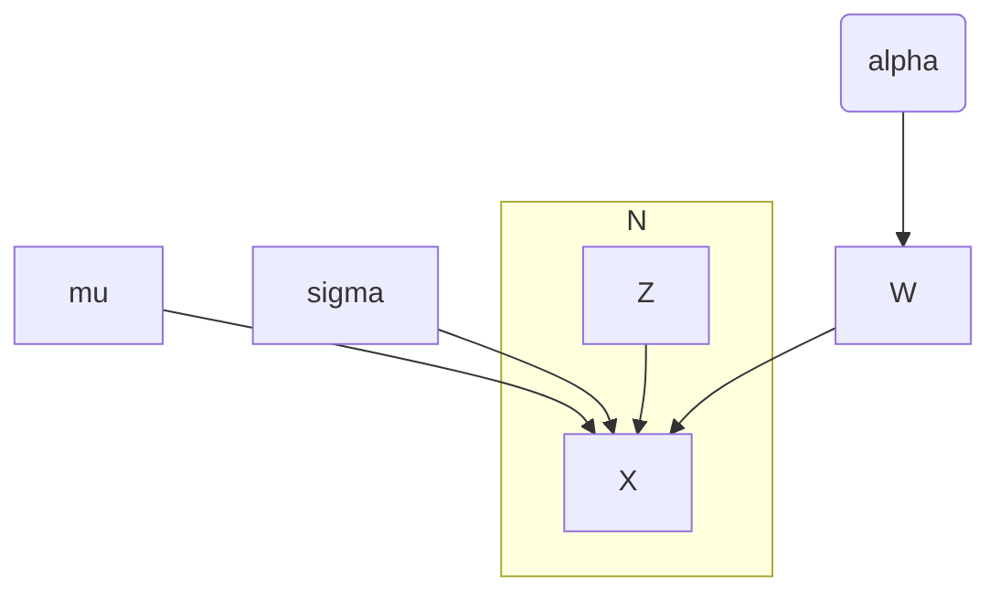

# Bayesian PCA

## Probabilistic PCA

For $N$ observations we observe the data $x$, which may include missing values. We assume that the data was drawn from an unobserved (complete) latent distribution $z$:

$$
    x \sim z
$$

We assume that $x$ is generated from $z$ process ($N$ observations, $d$ features, $k$ latent dimensions).

$$
x^{N \times d} = z^{N \times k} W^{k \times d} + \mu^{1\times d} + \varepsilon^{1\times d}
$$

Where $W$ is the loadings/weight matrix, $z$ is the factor activity, $mu$ is the estimated mean of the sample and $\varepsilon$ is the noise vector, assuming constant feature-wise noise levels

$$
\varepsilon \sim \mathcal{N}(0, \sigma^2 I)
$$

The goal of BPCA is to infer the latent distribution $z$ from the provided data given this model.

Given the assumption of a normal noise model _likelihood function_ (likelihood of the data given the latent variable, $p(x|z)) is therefore

$$
    p(x | z) = \mathcal{N}(zW + \mu, \sigma^2 I)
$$

This yields the marginal distribution (the probability of the observed data integrated over the full parameter space) is then:

$$
    p(x) = \int{p(x|z)p(z) \mathrm{d}z} = \mathcal{N}(\mu, C)
$$

With $
    p(x | z) = \mathcal{N}(zW + \mu, \sigma^2 I)
$ and assuming a prior distribution $p(z) = \mathcal{N}(0, I)$ this yields

$$
    p(x) = \mathcal{N}(\mu, WW^T + \sigma^2I)
$$

## Bayesian PCA
Bayesian PCA further enables the automatic estimation of the dimensionality of the data by enforcing an Automatic Relevance Determining prior. The prior sets unnecessary dimensions to zero and retains only dimensions that explain meaningful amounts of variance in the data.

It introduces a hierarchical prior over the weight matrix $p(W|alpha)$ via a $k$ dimensional vector $alpha^{k \times 1}$

The latent space is fitted on the maximally possible dimensionality of the space ($k=d-1$) and the prior is defined as

$$
    p(W|\alpha) = \prod_{i=1}^{d-1}{\left(\left( \frac{\alpha_i}{2\pi} \right)^{d/2} \exp{\left(
        -\frac{1}{2} \alpha_i ||w_i||^2
    \right)}\right)}
$$

## EM estimation

### E-step

$$
    M = W^TW + \sigma^2I
$$

$$
    \langle z_n \rangle = M^{-1}W^T(x_n -\mu)
$$

$$
    \langle z_n z_n^T \rangle = \sigma^2 M +  \langle z_n \rangle  \langle z_n \rangle^T
$$

### M-step

Update the model parameters with

$$
    \widetilde{W} =
    \left[
        \sum_{n}{(x_n - \mu)\langle z_n^T \rangle}
    \right]

    \left[
        \sum_{n}{\langle z_n z_n^T \rangle + \sigma^2 diag(a_i)}
    \right]^{-1}

$$

$$
    \widetilde{\sigma}^2 =
    \frac{1}{Nd}\sum_{n=1}^{N}{
        \left(
            ||x_n -  \mu ||^2 - 2 \langle z_n^T \rangle \widetilde{W}^T (t_n - \mu) + Tr\left(
                \langle z_n z_n^T \rangle
                \widetilde{W}^T  \widetilde{W}
                \right)
        \right)
    }
$$

$$
a_i = \frac{d}{||w_i||^2}
$$

